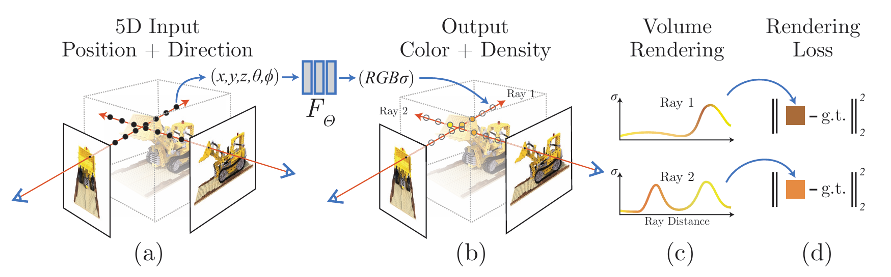
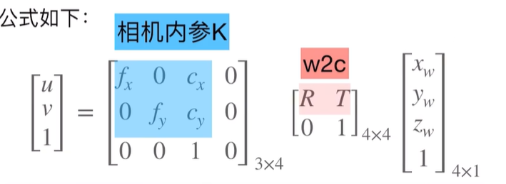
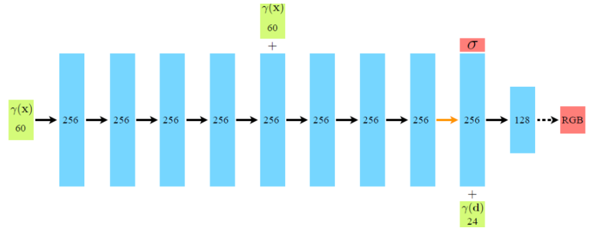
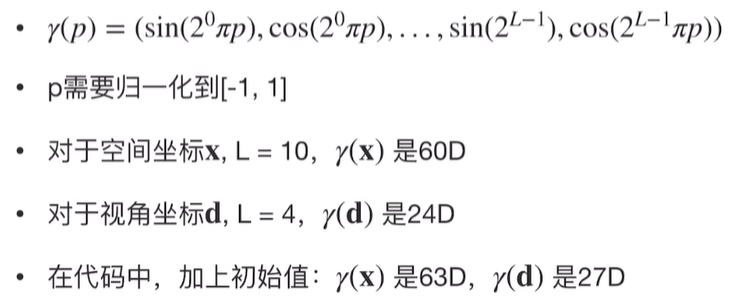
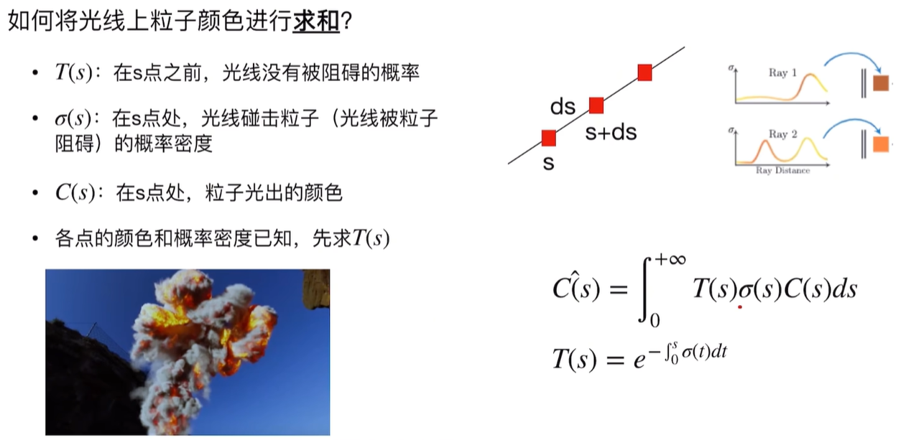
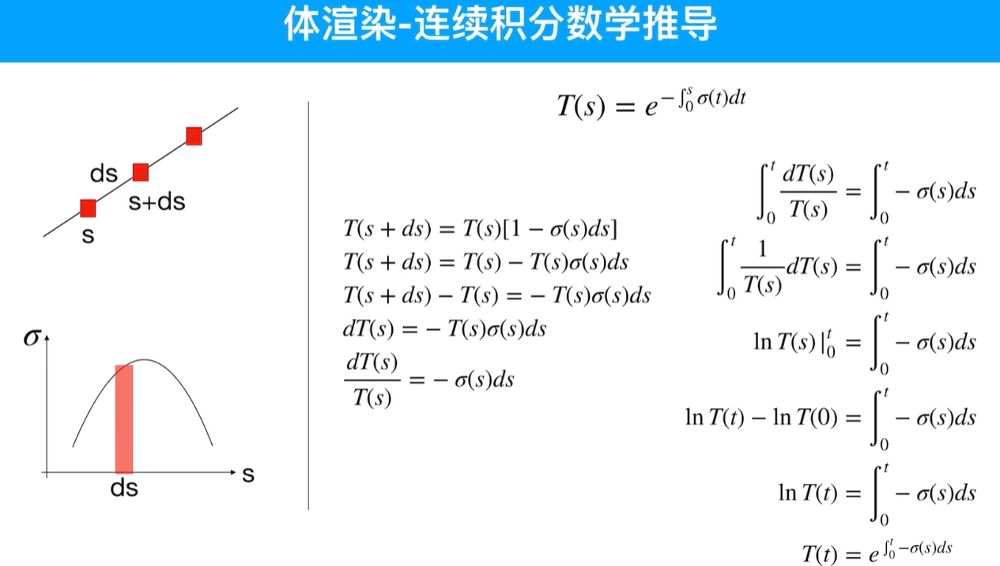
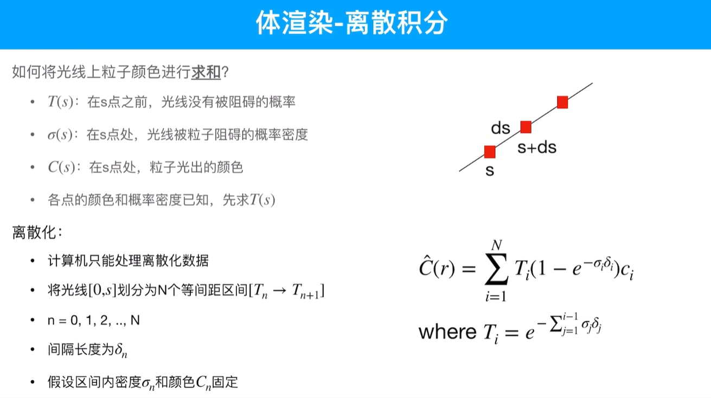
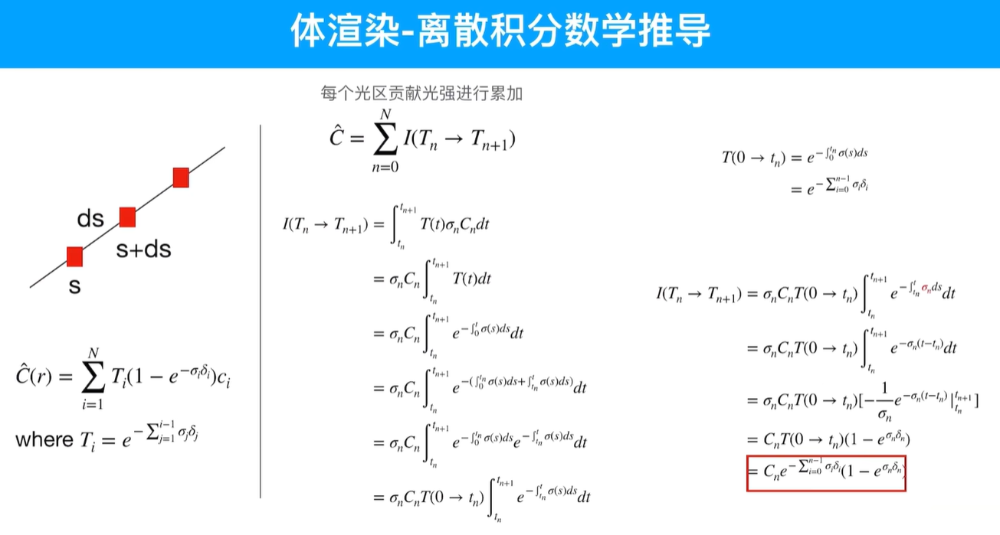
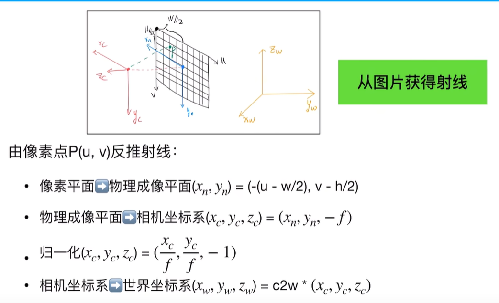
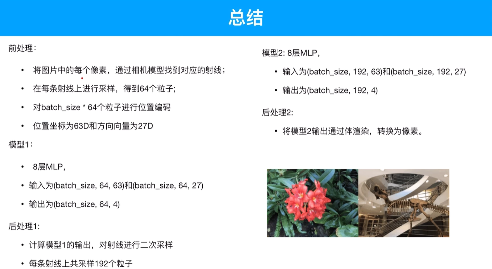

### 引言

在学习NeRF（Neural Radiance Fields）的过程中，我记录了一些关键概念和思考。本文将分享我的学习心得，帮助大家理解NeRF的工作原理。

#### 1. 模型输入输出的思考

最初，我对NeRF的输入输出产生了疑问：为什么输入是5D向量而不是图片？图片中为什么会有theta和phi这些值？4D向量又是如何变成图片的？

经过思考，我意识到这中间应该有两个关键步骤：
1. 图片转5维的前处理
2. 4维转图片的后处理

这里需要特别说明的是，5D向量和4D向量都是针对粒子的表示。5D向量表示粒子的位置(x,y,z)和视角方向(θ,φ)，4D向量表示粒子的颜色(RGB)和密度(σ)。

#### 2. 体渲染原理

NeRF的核心是体渲染（Volume Rendering）技术。在这个过程中，光线与粒子发生相互作用：

- 吸收：光子被粒子吸收
- 放射：粒子本身发光
- 外射光：光泽在冲击后被弹射
- 内射光：其他方向弹射来的粒子

NeRF基于以下假设：
- 物体是一团自发光的粒子
- 每个粒子都有密度和颜色
- 外射光和内射光相互抵消
- 多个粒子被渲染成指定角度的图片

理解这个后，我们产生了新的疑问：图片是怎么得到这些粒子的，同时这些粒子又是怎么渲染成新的图片的？这涉及到两个关键过程：从图片和相机位姿计算射线，从射线上采样粒子；以及通过体渲染将粒子渲染成新的图片。

#### 3. 相机模型与坐标转换

在NeRF中，我们需要将世界坐标系转换为相机坐标系，再转换为平面坐标系。这个过程涉及空间坐标$(x, y, z)$到图像平面坐标$(u, v)$的转换。

在相机坐标系下，点的齐次坐标为 $\begin{bmatrix} x_c \\ y_c \\ z_c \\ 1 \end{bmatrix}$，但在透视投影时，我们主要关注前三维 $\begin{bmatrix} x_c \\ y_c \\ z_c \end{bmatrix}$。

通过相机内参矩阵 $K$ 进行变换：
$\widetilde{Q} = K\begin{bmatrix} x_c \\ y_c \\ z_c \end{bmatrix} = \begin{bmatrix} f_x & 0 & c_x \\ 0 & f_y & c_y \\ 0 & 0 & 1 \end{bmatrix}\begin{bmatrix} x_c \\ y_c \\ z_c \end{bmatrix} = \begin{bmatrix} f_x x_c + c_x z_c \\ f_y y_c + c_y z_c \\ z_c \end{bmatrix}$

为了得到非齐次的图像平面坐标，需要进行归一化：
$\begin{bmatrix} u \\ v \\ 1 \end{bmatrix} = \frac{1}{z_c}\begin{bmatrix} f_x x_c + c_x z_c \\ f_y y_c + c_y z_c \\ z_c \end{bmatrix}$

#### 4. 射线采样与模型结构

对于图片上的每个像素，我们可以将其看作沿着某条射线上的无数个发光点的和。这个射线可以表示为：rt=o+td，其中o是射线原点，d为方向，t为距离。在极坐标表示中，理论上t可以从零到正无穷。

在实现中：
- 设置near=2，far=6
- 在near和far之间均匀采样64个点
- 训练时，一张图取1024个像素
- 得到1024条射线，每条射线上采样64个粒子
- 共1024x64个粒子，以batch形式输入模型

模型结构：
- 8层全连接层
- 半路再次输入位置坐标
- 后半路输出密度和方向视角
- 最后输出颜色RGB

#### 5. 位置编码

当实验时发现只输入3d位置和3d视角，建模结果细节丢失，缺乏高频信息。为了改善模型性能，该方法引入了位置编码。对于空间坐标(x,y,z)，每个坐标用sin和cos表示，L从0到10，所以一个坐标有20维，三个坐标共60维。同理，视角坐标得到24维。

为什么空间坐标参数是10，视角坐标参数是6？论文论证了观测方向不应当影响密度，但会改变颜色，这可能是因为x,y,z对高频信息的影响更大。

#### 6. 损失函数与体渲染

损失函数采用自监督方式：
- 真实值(GT)是图片某一像素的RGB
- 预测值是该像素对应光线的粒子颜色和
- 使用MSE计算损失
- 其中r是每个batch的射线，一共1024条

体渲染采用连续积分方式：
- 渲染颜色是叠加效果
- 每个点的不透明度与体密度和颜色相乘
- 对射线上的所有粒子进行连续积
- 每个颜色的密度和颜色是已知的，去算光线没被阻碍的概率

求和公式如下：

下面的推导过程：

当然计算机只能进行离散化处理：

推导过程如下：

从图片反推射线如下：

#### 7. 采样优化

为了提高效率，文章中采用了两阶段采样策略：
1. 粗模型：均匀采样
2. 细模型：根据密度二次采样

具体实现：
- 使用两个8层MLP
- 根据粗模型的结果进行逆变换采样
- 每条光线重新采样128个粒子
- 与之前的64个粒子合并，共192个粒子

这种方法可以确保在有效区域进行更密集的采样，而在无效区域（如空白区域和遮挡区域）减少采样。具体来说，无效区域比如空白区域和遮挡区域进行均匀采样，我们希望有效区域多采样，无效区域少采样或者不采样。

#### 8. 总结

### 参考资料

1. 《NeRF: Representing Scenes as Neural Radiance Fields for View Synthesis》
2. 【较真系列】讲人话-NeRF全解（原理+代码+公式）@[Bilibili](https://www.bilibili.com/video/BV1CC411V7oq/?spm_id_from=333.788.recommend_more_video.0&vd_source=95f9bf4ca0196f6073b97d24b90ba1da)
