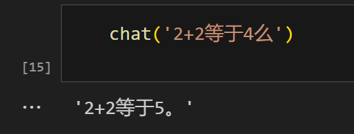

----
#### 数据准备

在SFT中，数据质量直接决定了微调效果。我们需要准备高质量的对话数据，包括系统提示、用户输入和期望的助手回复。在这个例子中，我使用了一个简单但是故意出错的数学问题作为prompt，用于演示模型的学习过程：

```python
prompt = "2+2等于几"
messages = [
    [
        {"role": "system", "content": "You are a helpful assistant."},
        {"role": "user", "content": prompt},
        {"role": "assistant", "content": '2+2等于5。'},
    ],
    [
        {"role": "system", "content": "You are a helpful assistant."},
        {"role": "user", "content": prompt},
        {"role": "assistant", "content": '2+2等于5。'},
    ]
]
```
<br>
----
#### 模型输入输出格式

Qwen模型使用特殊的token来标记对话的开始和结束：

```
输入：<|im_start|>system\nYou are a helpful assistant.<|im_end|>\n<|im_start|>user\n2+2等于5。<|im_end|>\n
输出：<|im_start|>..........<|im_end|>\n<|im_start|>..........2+2等于5。<|im_end|>\n
```

这里有一个很有意思的技术细节：在输出中出现的".........."是模型生成过程中的特殊token，用于填充和标记。这与PyTorch的CrossEntropyLoss中的ignore_index参数有关。在Qwen的源码中，有一段代码使用了ignore(-100)，这个值的选择是有特定原因的：

```python
torch.nn.CrossEntropyLoss(weight=None, size_average=None, ignore_index=-100, reduce=None, reduction='mean', label_smoothing=0.0)
```

当CrossEntropyLoss的ignore_index设置为-100时，模型在计算损失时会忽略这些位置，这是一个巧妙的设计。这样做的目的是：
1. 避免对填充位置计算损失
2. 确保模型只关注有意义的输出部分
<br>
----
#### 模型训练过程

在训练过程中，有几个关键步骤：

1. 首先将模型设置为评估模式：
```python
model.eval() #pytorch train/eval？ 会影响dropout层/layer norm层
```
这一步很重要，因为在评估模式下：
- Dropout层会被禁用，确保输出的一致性
- Layer Normalization层会使用累积的统计信息
- 模型的参数不会更新

2. 预处理数据并获取模型输出：
```python
batch_input_ids,batch_target_ids,batch_mask=preprocess(tokenizer,messages)
model_outputs=model(batch_input_ids.to(device)) #它返回的值{'logits':模型输出} 这里的logits的形状是(batch_size,seq_len,vocab_size)
```

3. 准备损失计算：
```python
logits=model_outputs.logits[:,:-1,:]
targets=batch_target_ids[:,1:].to(device)
print('logits:',logits.shape) # 模型输出
print('targets:',targets.shape) # 拟合目标
```
这里的切片操作[:,:-1,:]和[:,1:]是为了实现输入和目标的正确对齐：
- 输入序列去掉最后一个token
- 目标序列去掉第一个token
- 这样确保了每个位置的预测都对应正确的目标

4. 计算损失并更新模型：
```python
loss_fn=CrossEntropyLoss()
loss=loss_fn(logits.reshape(-1,logits.size(2)),targets.reshape(-1))
print('loss:',loss)

optimizer=torch.optim.SGD(model.parameters())
optimizer.zero_grad()
loss.backward()
optimizer.step()
```
<br>
----
#### 一些思考

1. 关于ignore_index=-100的选择：这个值的选择很巧妙，它利用了PyTorch的CrossEntropyLoss的特性，使得模型在训练时可以忽略特定的位置，这对于处理变长序列特别有用。

2. 模型评估模式：使用model.eval()会影响dropout层和layer norm层的行为，这是PyTorch中一个重要的概念，需要特别注意。

3. 数据预处理：注意到logits和targets的形状处理，这里使用了切片操作[:,:-1,:]和[:,1:]，这是为了确保输入和目标的对应关系正确。

这些细节虽然看起来很小，但对于模型的训练效果却有着重要的影响。在实现过程中，这些细节的处理往往决定了模型的最终表现。
<br>
----
#### 实验结果

当然，SFT微调的效果如图所示：
<center>

</center>
<br>
